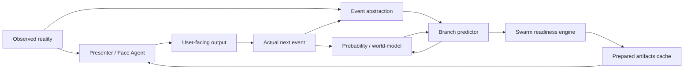
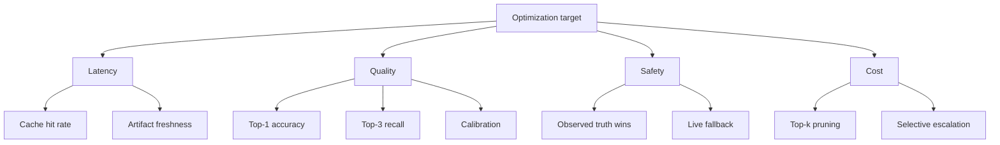
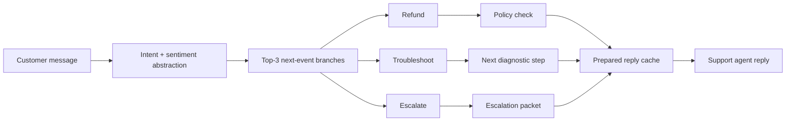
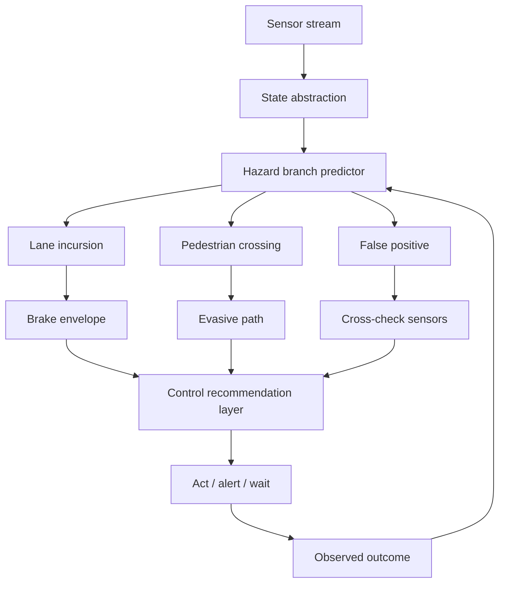
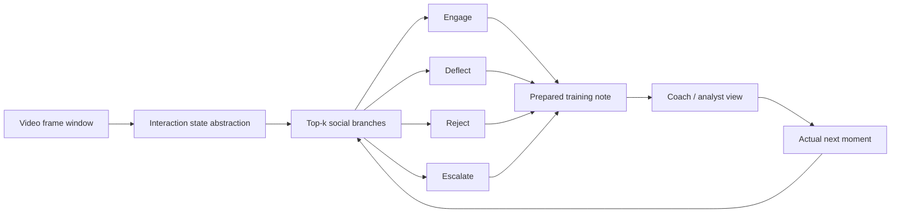
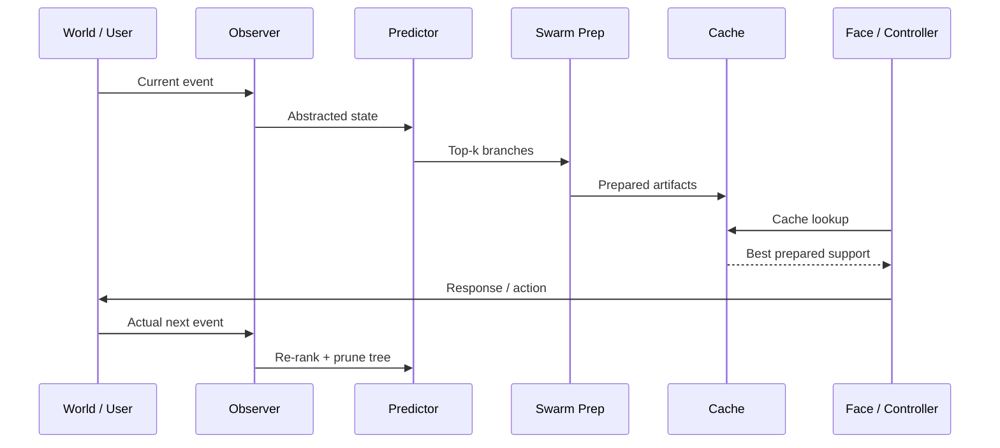

# Precognitive Probability Tree — Product Concept Sheet

This document turns the precognitive probability tree architecture into three practical product concepts. The common operating model is a multi-layer system in which a visible presenter responds to observed reality, a background readiness layer predicts likely next events and prepares artifacts, and a probability/world-model layer maintains and prunes a live tree of near-future possibilities.

## Core operating model

- **The visible agent** handles the present moment and uses prepared artifacts only when they are strong enough to trust.
- **The readiness engine** generates top-k next-event branches, prepares support artifacts, and optimizes for expected readiness rather than perfect forecasting.
- **The probability engine** updates branch rankings after every real event, prunes dead paths, and escalates to richer simulation only when the expected value justifies the cost.

## Optimization priorities

- **Largest latency win:** Cache hit rate on high-confidence branches, because the presenter can answer with prepared support instead of reasoning from scratch.
- **Largest quality win:** Better next-event prediction and branch ranking, because only a few branches are worth expensive preparation.
- **Largest safety win:** Strict separation between predicted possibilities and observed truth, so simulation never leaks into user-facing facts.
- **Largest cost control lever:** Stage-gated escalation from cheap branch prep to deeper multi-agent simulation only on high-impact, high-uncertainty branches.

## Use case 1 — Support foresight copilot

- **Product name:** QueueAhead.
- **Target user:** Support teams, AI customer service copilots, outsourced support operations.
- **Problem:** Support sessions slow down when the assistant waits for each customer turn before looking up policy, drafting the next response, or preparing a recovery move.
- **Core promise:** Reduce time-to-useful-response by preparing the next likely resolution paths before the customer asks for them.
- **Typical branches:** Refund request, failed troubleshooting loop, identity verification issue, escalation request, frustration spike.
- **Prepared artifacts:** Policy snippets, refund eligibility checks, escalation macro, troubleshooting decision tree, empathy-safe recovery draft.
- **Most important optimization points:** Branch ranking precision, cache freshness after every customer reply, and sentiment-aware escalation thresholds.
- **Main moat:** Fast and context-grounded next-step preparation across messy real conversations rather than static canned responses.
- **Main risk:** Over-preparing generic support content that does not materially beat a simpler retrieval-plus-draft baseline.
- **MVP scope:** One queue type, one policy domain, one escalation tree, and instrumentation for cache hit rate, reply latency, and recovery after wrong-branch prep.

## QueueAhead metrics

- **Latency:** Median time-to-useful-response, P95 response latency, cache-hit speedup delta.
- **Readiness:** Prepared artifact reuse rate, branch survival rate, recovery time after wrong branch.
- **Quality:** Resolution rate, escalation appropriateness, customer satisfaction change.
- **Safety:** Hallucinated policy rate, stale artifact rate, unsupported refund recommendation rate.

## Use case 2 — MotionShield safety foresight

- **Product name:** MotionShield.
- **Target user:** Robotics teams, vehicle-assist systems, warehouse safety supervisors, autonomy researchers.
- **Problem:** Physical systems often have only fractions of a second to react, so waiting to interpret a hazardous event after it fully unfolds is too slow.
- **Core promise:** Maintain a sparse hazard tree of likely near-term outcomes and prepare safe fallback actions before the hazard fully materializes.
- **Typical branches:** Lane incursion, abrupt stop, pedestrian crossing, restricted-zone entry, sensor false positive.
- **Prepared artifacts:** Safe braking envelope, alternate path, human-override alert, confidence downgrade, sensor cross-check routine.
- **Most important optimization points:** Hard latency budgets, false-intervention minimization, and aggressive pruning of low-value branches.
- **Main moat:** Sparse, grounded near-term hazard readiness instead of expensive always-on deep simulation.
- **Main risk:** Premature intervention from poorly calibrated hazard probabilities.
- **MVP scope:** One environment, a handful of hazard classes, and a simulator-backed evaluation loop before any live deployment.

## MotionShield metrics

- **Latency:** Detection-to-fallback latency, control recommendation latency, P99 worst-case budget.
- **Readiness:** Hazard branch recall, prepared fallback availability, branch-pruning efficiency.
- **Quality:** Safe outcome rate, intervention appropriateness, recovery quality after misprediction.
- **Safety:** False positive intervention cost, missed hazard cost, rule-violation rate.

## Use case 3 — SceneSense interaction simulator

- **Product name:** SceneSense.
- **Target user:** Training platforms, behavioral researchers, interview coaches, social robotics teams.
- **Problem:** Social interactions are sequential and branchy, but most analysis tools either over-explain them after the fact or fail to predict the next likely move in a measurable way.
- **Core promise:** Track a sparse lineage of likely social outcomes while a recorded interaction unfolds, then compare branch predictions against the actual path for training and evaluation.
- **Typical branches:** Deflect, engage, reject, perform for audience, escalate discomfort.
- **Prepared artifacts:** Next-turn prediction, social-state labels, intervention suggestions, alternate branch explanations, post-hoc replay summary.
- **Most important optimization points:** Good event abstraction from ambiguous human signals, branch diversity without narrative drift, and strong calibration against real sequence outcomes.
- **Main moat:** A measurable bridge between video observation, next-event prediction, and training feedback.
- **Main risk:** Narrative coherence outpacing evidence, which the architecture explicitly warns against in weak-fit scenarios.
- **MVP scope:** Offline analysis of sequential social clips with known outcomes, branch scoring, and evaluator review tools.

## SceneSense metrics

- **Latency:** Batch processing speed per minute of video, branch update time per frame window.
- **Readiness:** Artifact usefulness to reviewers, branch persistence quality, replay insight coverage.
- **Quality:** Top-1 next-event accuracy, top-3 recall, calibration score, evaluator agreement.
- **Safety:** Unsupported behavioral claims, overconfident branch labeling, sensitive inference leakage.

## Shared system loop

All three products use the same receding-horizon loop: observe reality, abstract the event, generate a small number of likely next branches, prepare only the branches worth paying for, let the presenter or controller act on current truth, then prune and regenerate after the actual event arrives.

## Best first build order

- **First:** SceneSense, because it is low-risk, offline-friendly, and gives clean ground truth for branch evaluation.
- **Second:** QueueAhead, because it is the easiest to operationalize and has obvious latency and helpfulness metrics.
- **Third:** MotionShield, because it has the highest long-term value but also the strictest safety and latency requirements.

## What to optimize first

| Focus area              | Why it matters                                            | Early KPI                     |
| ----------------------- | --------------------------------------------------------- | ----------------------------- |
| Event abstraction       | Bad abstraction poisons every downstream branch           | Branch discrimination quality |
| Top-k branch generation | Most value comes from preparing only a few likely futures | Top-3 recall                  |
| Cache freshness         | Prepared help must match the current moment               | Artifact stale rate           |
| Escalation gating       | Deeper simulation should be rare and justified            | Expensive branch rate         |
| Truth separation        | Predicted futures must never leak as confirmed facts      | Speculation leak rate         |

## A useful design mantra

The winning product is not the one that predicts the future most dramatically. It is the one that meets the next moment with the least waste, the lowest surprise, and the highest practical readiness.

------

[@nickwichman](https://x.com/nickwichman)