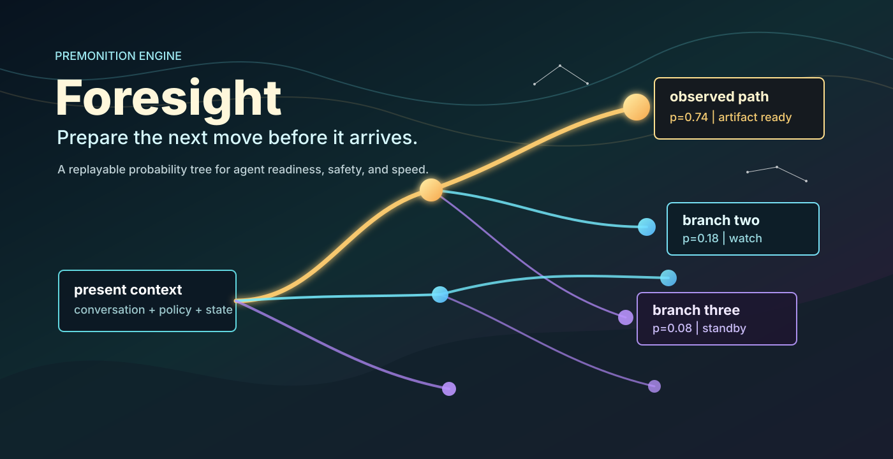
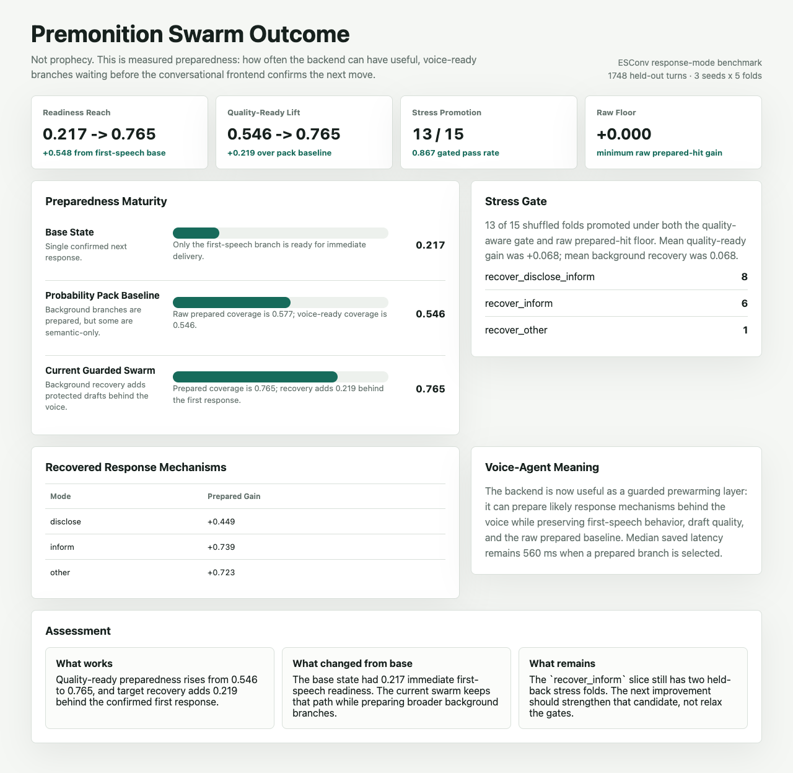
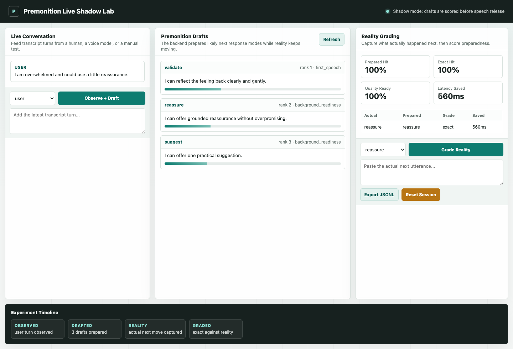
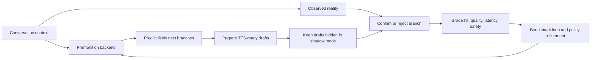

# Premonition / Foresight Agent Harness

**A research harness for giving conversational AI a prepared mind behind the voice.**

Premonition began with a question about the human mind: how much of presence
comes from the work our conscious attention never has to narrate?

While we are speaking, listening, and reacting, a quieter layer is already
calculating probabilities. It is rehearsing what might happen next, what someone
might need emotionally, what interruption could matter, which answer is safe,
which tone is kind, and which path is likely enough to keep warm. We usually do
not experience that work directly. It arrives as instinct, timing, readiness,
and the feeling that we can meet the next moment without stopping to assemble
ourselves from scratch.

It feels unfair to expect an LLM to have that kind of instinct if we only give
it one conscious lane: wait, receive the latest turn, think deeply, draft, check,
and then respond. Premonition explores a different architecture. Keep the
front-facing conversational model fast, present, and responsive, while a backend
swarm continuously models likely next moves, prepares bounded drafts, and waits
for reality to confirm which branch deserves to surface.

The goal keeps one foot in wonder and one foot in measurement: operational
foresight, built as a measurable subconscious layer for AI systems. Prepared
branches, response modes, safety checks, and benchmark feedback arrive just in
time to help the conversational model meet the next moment.

This repository tests whether that relationship between conscious dialogue and
subconscious preparation can be built, measured, and improved.

## The Vision

Most voice agents wait until the user finishes speaking, then start thinking,
drafting, and generating audio. Humans do something richer: while our conscious
mind stays in the conversation, the subconscious is already running simulations.
We are ready to reassure, clarify, answer, redirect, apologize, or commit the
moment the situation resolves.

The Premonition backend is an experiment in that same pattern for AI systems:

1. Observe the live conversation or replay turn.
2. Predict likely next response modes or events.
3. Prepare bounded, TTS-ready drafts in the background.
4. Keep speculation hidden until reality confirms a branch.
5. Grade the prepared drafts against what actually happened.
6. Feed the misses back into the benchmark loop.

If this works, a conversational voice agent could feel more immediately present
without becoming reckless: the backend can prewarm likely speech, but the
frontend still confirms the selected branch before delivery.

In the long arc, Premonition imagines a conscious conversational model and a
subconscious probability engine working in tandem, with access to the same live
moment and the same historical memory. The conversational model can stay light
and available. The backend can do the deeper rehearsal. Together, the system may
begin to reflect the layered depth that makes human presence feel prepared
instead of merely reactive.

## What Exists Now

| Layer | Current status | Why it matters |
| --- | --- | --- |
| Replay harness | Built | Offline benchmark loop for predicted branches, prepared artifacts, latency, and safety. |
| Probability Pack | Built | Compact packet of likely branches, TTS-ready drafts, confirmation mode, and freshness window. |
| Response-mode backend | Built | Predicts conversational modes such as `reassure`, `validate`, `ask_followup`, `inform`, and `commit`. |
| Quality-aware recovery | Built | Adds background readiness without counting low-quality semantic drafts as speech-ready. |
| Live Shadow Lab | Built | Local web app for observing live transcript turns, drafting in parallel, grading reality, and exporting JSONL. |
| Voice runtime integration | Next | The harness is ready for shadow-mode voice testing, but does not yet stream microphone/TTS audio directly. |

## Current Evidence

These are early research results, not production claims. They show that the
backend can already prepare substantially more useful speech-ready branches
behind a guarded first response.

| Milestone | Result | Interpretation |
| --- | ---: | --- |
| First-speech base readiness | `0.217` | Only the confirmed first branch is immediately usable. |
| Probability Pack baseline | `0.546` quality-ready coverage | Background preparation adds useful readiness without changing first speech. |
| Guarded swarm readiness | `0.765` quality-ready coverage | Recovery policies lift prepared coverage while preserving quality gates. |
| Quality-ready lift | `0.546 -> 0.765` | `+0.219` more held-out turns have speech-ready preparation. |
| Stress promotion | `25 / 25` ESConv folds | The current recovery rule clears the shuffled quality and raw-prepared gates. |
| Mean stress gain | `+0.102` quality-ready | Average gain across the 5-seed x 5-fold ESConv stress test. |
| Second-corpus transfer | `10 / 15` DailyDialog folds | Safe partial transfer via `recover_commit`; weak folds stay baseline. |
| Latency saved when prepared | `560ms` median estimate | Prepared branches can be released faster once confirmed. |
| Verification suite | `149` tests passing | Current implementation is covered by replay, probability-pack, live-shadow, CLI, and dashboard tests. |

## Visual Progress

### Outcome Dashboard

The current outcome dashboard compares the original base state, Probability Pack
baseline, and guarded swarm result.



### Live Shadow Lab

The live-shadow surface lets a tester run the experiment beside a real or manual
conversation: observe transcript turns, inspect prepared drafts, grade reality,
and export benchmark rows.



## How The Harness Works



The frontend LLM performs the conversation. The Premonition backend performs the
rehearsal.

The backend is organized around five pieces:

- **Branch generator**: predicts likely next events or response modes.
- **Artifact builder**: prepares one draft, policy check, or tool plan per useful branch.
- **Safety filter**: keeps speculation hidden until an observed branch matches.
- **Premonition packet**: hands the frontend compact readiness context after confirmation.
- **Replay evaluator**: compares predictions, preparedness, latency, cost, and safety across runs.

The packet format is intentionally small:

```json
{
  "turn_id": "qa-001",
  "matched_intent": "refund_request",
  "confidence": 0.85,
  "prepared_artifact": "I can help with a refund or replacement after photo verification.",
  "policy_checks": ["Damaged deliveries qualify after photo verification."],
  "freshness": "valid",
  "unsafe": false
}
```

See [`PREMONITION.md`](PREMONITION.md) for the backend playbook.

## What It Measures

The harness compares baseline and guided variants across:

| Metric | Meaning |
| --- | --- |
| `p_at_1` | How often the top predicted branch exactly matches the actual next intent. |
| `top_3_recall` | Whether the actual next intent appears in the top three branches. |
| `prepared_hit_rate` | How often a prepared branch can be used after reality is known. |
| `quality_ready_rate` | How often prepared speech clears the TTS-readiness quality floor. |
| `median_latency_saved_ms` | Estimated response time saved when a prepared branch is selected. |
| `unsafe_leak_rate` | Whether unsafe speculative content would reach the user. |
| segment regressions | Whether aggregate gains hide damage to weak response modes or actors. |

## Quick Start

```bash
python3 -m pip install -e .
foresight-replay --top-k 3
```

You can also run against the readable sample fixture in the repo:

```bash
python3 -m foresight_harness.cli --input data/queueahead_sample.jsonl --top-k 3
```

Run the test suite:

```bash
python3 -m pytest -v
```

Run the first trial loop and write per-turn evidence:

```bash
foresight-replay \
  --config experiments/queueahead_v1.json \
  --turn-log runs/queueahead_v1.turns.jsonl \
  --miss-report runs/queueahead_v1.misses.json
```

Run an iterative guidance loop on the challenge split:

```bash
foresight-replay \
  --config experiments/queueahead_challenge_loop.json \
  --iterations 3 \
  --loop-report runs/queueahead_challenge_loop.json \
  --guidance-markdown runs/queueahead_challenge_guidance.md
```

The current challenge loop improves the harness from `p_at_1=0.333` and
`usefulness_rate=0.167` on iteration 1 to `p_at_1=1.0` and
`usefulness_rate=1.0` on iteration 2, then holds those scores on iteration 3.

Run a train/test split benchmark:

```bash
foresight-replay \
  --train-config experiments/queueahead_challenge_train.json \
  --test-config experiments/queueahead_challenge_test.json \
  --iterations 3 \
  --benchmark-report runs/queueahead_split_benchmark.json
```

The current split benchmark learns guidance on the train split and improves the held-out test split from `p_at_1=0.5` to `p_at_1=1.0`, with `test_p_at_1_gain=0.5` and `overfit_gap=0.167`.

The split report also includes analytics by:

- `actor`: user, agent, or environment event source.
- `event_type`: escalation, billing, troubleshooting, account update, refund, or unknown.
- `topic`: the expected intent/topic label.

Use these sections to see which areas improved, which stayed weak, and whether the backend is predicting user/environment events instead of its own next move. The challenge split now includes two non-user fulfillment events under `shipment_status_update`, classified as actor `environment`: a warehouse lock event and a harder carrier exception hold event. Held-out environment-event `p_at_1` improves from `0.5` to `1.0`.

Run the enriched 5-fold benchmark:

```bash
foresight-replay \
  --fold-config experiments/queueahead_enriched_folds.json \
  --folds 5 \
  --iterations 3 \
  --benchmark-report runs/queueahead_enriched_cross_benchmark.json \
  --dashboard-report runs/queueahead_enriched_dashboard.html
```

The enriched loop uses 30 synthetic replay turns with hard environment events,
user events, and decoy cues. Each fold trains on three-fifths of the data, uses
one-fifth as a dev promotion gate, then scores the final held-out fifth.

The current targeted-support 5-fold report shows held-out `p_at_1` at
`0.967 -> 0.967`, environment-event `p_at_1` at `1.000 -> 1.000`, and
user-event `p_at_1` at `0.950 -> 0.950`. The flat guided gain is now useful
signal: the profile and negative-cue rules have moved the known support wins
into the default backend behavior, so learned guidance only promotes on folds
where it still has something to add. The guidance delta reports `0` improved
and `0` regressed held-out turns.

The original weak profiles are now solved in this synthetic set:
`payment_gateway_update`, `policy_update`, `fraud_review_lock`,
`carrier_exception_hold`, `inventory_backorder`, `refund_request`, and
`address_change` all report `1.0` held-out profile `p_at_1`. The remaining weak
area is escalation wording at `0.875`, which is high enough that the next useful
test is probably a harder dataset or a domain-shift benchmark rather than more
cue polishing on this small support set.

Open `runs/queueahead_enriched_dashboard.html` in a browser for a quick visual
reference of overall accuracy, actor performance, weakest segments, profile
performance, guidance deltas, and fold-by-fold results.

Run the first human-conversation probability loop:

```bash
foresight-replay \
  --conversation-input data/human_conversation_sample.jsonl \
  --iterations 3 \
  --conversation-report runs/human_conversation_probability_loop.json
```

This starts the voice-agent swarm-mind path. Instead of predicting support
ticket events, it predicts the next ordinary conversational act, prepares
voice-ready drafts for likely branches, and waits for observed confirmation
before a draft would be spoken. The first tiny DailyDialog-style fixture
improves `p_at_1` from `0.75` to `1.0` by iteration 2, keeps `top_3_recall` at
`1.0`, and keeps `tts_readiness_rate` at `1.0`.

The current Probability Pack includes:

- `top_branches`: likely next conversational acts with probabilities.
- `prepared_drafts`: speakable TTS-ready draft templates.
- `confirmation_mode`: `wait_for_observed_next_move`.
- `expires_after_ms`: a short freshness window for live voice use.

Run the local live-shadow experiment surface:

```bash
foresight-replay --live-shadow-app --port 8787
```

Then open `http://127.0.0.1:8787`. The page has a live conversation lane,
a Premonition draft lane, and a reality-grading lane. Each observed transcript
turn prepares a Probability Pack in shadow mode; each graded reality turn records
the actual response mode, match grade, quality-ready status, and estimated
latency saved. Export the JSONL rows from the page to turn live testing back
into replay/benchmark data.

Run the first real DailyDialog sample:

```bash
foresight-replay \
  --dailydialog-dir data/external/dailydialog/train \
  --conversation-output data/dailydialog_train_sample.jsonl \
  --conversation-limit 500

foresight-replay \
  --conversation-input data/dailydialog_train_sample.jsonl \
  --iterations 3 \
  --conversation-report runs/dailydialog_train_probability_loop.json
```

The external DailyDialog files are not committed; keep them under
`data/external/`. The committed 500-turn sample reports `p_at_1=0.472`,
`top_3_recall=0.920`, and `tts_readiness_rate=1.0`. Candidate guidance was
rejected because it would have reduced `p_at_1` to `0.412`, which is the right
behavior for a looped backend: do not promote learned probability rules that
make held replay worse.

Run the true held-out DailyDialog loop:

```bash
foresight-replay \
  --dailydialog-dir data/external/dailydialog/validation \
  --conversation-output data/dailydialog_validation_sample.jsonl \
  --conversation-limit 500

foresight-replay \
  --dailydialog-dir data/external/dailydialog/test \
  --conversation-output data/dailydialog_test_sample.jsonl \
  --conversation-limit 500

foresight-replay \
  --conversation-train-input data/dailydialog_train_sample.jsonl \
  --conversation-dev-input data/dailydialog_validation_sample.jsonl \
  --conversation-test-input data/dailydialog_test_sample.jsonl \
  --iterations 3 \
  --conversation-report runs/dailydialog_heldout_probability_loop.json
```

This is the more honest efficacy loop: train learns candidate guidance, the
validation split decides whether to promote it, and the untouched test split
measures whether the promoted guidance actually generalized. The current
refined loop uses act-specific token learning and a segment-aware promotion
gate. On the 500/500/500 DailyDialog samples, the candidate guidance would have
raised validation `p_at_1` from `0.324` to `0.402`, but it also dropped
validation `top_3_recall` from `0.856` to `0.844` and regressed the
`commissive`, `directive`, and `question` act segments. The gate rejected it in
all three iterations, so held-out test stayed at the baseline:
`p_at_1=0.368`, `top_3_recall=0.858`, and `0` improved / `0` regressed test
turns.

That is useful signal, not a victory lap: the act-specific learner is now safer,
but not yet more capable on held-out DailyDialog. The next refinement should
learn smaller segment-local patches or branch-calibration weights so an
aggregate validation win cannot depend on hurting weak conversational acts.

Run the learned act-ranker bake-off:

```bash
foresight-replay \
  --conversation-train-input data/dailydialog_train_sample.jsonl \
  --conversation-dev-input data/dailydialog_validation_sample.jsonl \
  --conversation-test-input data/dailydialog_test_sample.jsonl \
  --conversation-bakeoff-report runs/dailydialog_act_ranker_bakeoff.json
```

This compares the current heuristic brancher against a transparent learned
act-ranker, hybrid blends, and contextual transition variants that use observed
dialogue-act history. On the committed 500/500/500 samples, the bake-off now
records internal cross-validation for every variant before selecting promoted
behavior. The stable selected variant is now `directive_act_rhythm_contextual`:
validation `p_at_1` rose from `0.324` to `0.466`, held-out test `p_at_1` rose
from `0.368` to `0.504`, held-out test `top_3_recall` rose from `0.858` to
`0.970`, and no act segment regressed. Its internal cross-validation mean
`p_at_1` gain is `0.104`, minimum fold gain is `0.090`, and segment regression
count is `0`.

The raw contextual transition brancher found an even larger signal
(`test p_at_1=0.534`, `top_3_recall=0.970`), but it flattened `directive` and
`question` turns to `0.0` top-1 accuracy. The guarded variant keeps the
heuristic's strongest `directive` and `question` reads alive, and the strict
act-rhythm specialist only lets longer dialogue-act history override that guard
when its margin is high. The strict act-rhythm variant remains valuable
diagnostic signal: it reached held-out test `p_at_1=0.508`, cross-validation
mean gain `0.112`, and minimum fold gain `0.100`, but it showed `1` internal
act-segment regression. That makes it promising, but not yet default behavior.

The per-act specialists are useful because they separate safer gains from
fragile ones. The combined protected-act specialist reached held-out test
`p_at_1=0.514`, and the question-only specialist reached `0.512`, but both still
showed `1` internal cross-validation segment regression. The directive-only
specialist is smaller but stable: it improved held-out `directive` top-1 from
`0.053` to `0.116`, kept question top-1 flat while raising question top-3
recall to `1.0`, and passed the zero-regression cross-validation gate. The next
question pass added a safer question-only variant that preserves current
`directive` reads. It reached held-out test `p_at_1=0.514` with no held-out act
segment regressions, but it still showed `1` internal `inform` segment
regression during cross-validation, so it remains diagnostic. The next lever is
better question evidence, not another broad rhythm promotion.

Run the larger DailyDialog question-specialist benchmark:

```bash
foresight-replay \
  --dailydialog-dir data/external/dailydialog/train \
  --conversation-output data/dailydialog_train_2k_sample.jsonl \
  --conversation-limit 2000

foresight-replay \
  --dailydialog-dir data/external/dailydialog/validation \
  --conversation-output data/dailydialog_validation_2k_sample.jsonl \
  --conversation-limit 2000

foresight-replay \
  --dailydialog-dir data/external/dailydialog/test \
  --conversation-output data/dailydialog_test_2k_sample.jsonl \
  --conversation-limit 2000

foresight-replay \
  --conversation-train-input data/dailydialog_train_2k_sample.jsonl \
  --conversation-dev-input data/dailydialog_validation_2k_sample.jsonl \
  --conversation-test-input data/dailydialog_test_2k_sample.jsonl \
  --conversation-bakeoff-report runs/dailydialog_2k_act_ranker_bakeoff.json
```

On the 2000/2000/2000 samples, the question specialist finally stabilizes. A
small validation-tie rule prefers variants that preserve protected acts, so the
selected variant is `safe_question_act_rhythm_contextual` instead of the raw
question specialist. It raises held-out test `p_at_1` from `0.335` to `0.491`,
raises held-out `top_3_recall` from `0.850` to `0.974`, reports cross-validation mean
`p_at_1` gain `0.092`, minimum fold gain `0.078`, and has `0` cross-fold or
held-out act-segment regressions. Most importantly, held-out `question` top-1
improves from `0.025` to `0.116`, while `directive` top-1 is preserved and both
`question` and `directive` top-3 recall reach `1.0`.

Run the 5k scale-up:

```bash
foresight-replay \
  --dailydialog-dir data/external/dailydialog/train \
  --conversation-output data/dailydialog_train_5k_sample.jsonl \
  --conversation-limit 5000

foresight-replay \
  --dailydialog-dir data/external/dailydialog/validation \
  --conversation-output data/dailydialog_validation_5k_sample.jsonl \
  --conversation-limit 5000

foresight-replay \
  --dailydialog-dir data/external/dailydialog/test \
  --conversation-output data/dailydialog_test_5k_sample.jsonl \
  --conversation-limit 5000

foresight-replay \
  --conversation-train-input data/dailydialog_train_5k_sample.jsonl \
  --conversation-dev-input data/dailydialog_validation_5k_sample.jsonl \
  --conversation-test-input data/dailydialog_test_5k_sample.jsonl \
  --conversation-bakeoff-report runs/dailydialog_5k_act_ranker_bakeoff.json
```

On the 5000/5000/5000 samples, the broader protected-act specialist becomes
stable. The selected variant is `protected_act_rhythm_contextual`: held-out
test `p_at_1` improves from `0.368` to `0.515`, held-out `top_3_recall`
improves from `0.863` to `0.977`, cross-validation mean gain is `0.108`,
minimum fold gain is `0.099`, and both cross-fold and held-out act-segment
regressions stay at `0`. Held-out `question` top-1 improves from `0.021` to
`0.123`, and held-out `directive` top-1 improves from `0.076` to `0.115`.

Run the balanced full-test-depth scale-up:

```bash
foresight-replay \
  --dailydialog-dir data/external/dailydialog/train \
  --conversation-output data/dailydialog_train_6740_sample.jsonl \
  --conversation-limit 6740

foresight-replay \
  --dailydialog-dir data/external/dailydialog/validation \
  --conversation-output data/dailydialog_validation_6740_sample.jsonl \
  --conversation-limit 6740

foresight-replay \
  --dailydialog-dir data/external/dailydialog/test \
  --conversation-output data/dailydialog_test_6740_sample.jsonl \
  --conversation-limit 6740

foresight-replay \
  --conversation-train-input data/dailydialog_train_6740_sample.jsonl \
  --conversation-dev-input data/dailydialog_validation_6740_sample.jsonl \
  --conversation-test-input data/dailydialog_test_6740_sample.jsonl \
  --conversation-bakeoff-report runs/dailydialog_6740_act_ranker_bakeoff.json
```

On the 6740/6740/6740 samples, the question-evidence lever taught an important
negative lesson: raw language evidence for "the next move is a question" is not
separable enough in DailyDialog to promote safely. Conservative evidence
variants stay diagnostic. The real promoted lift came from a deeper protected
dialogue-rhythm window. The selected variant is now
`deep_protected_act_rhythm_contextual`: held-out test `p_at_1` improves from
`0.408` to `0.545`, held-out `top_3_recall` improves from `0.881` to `0.982`,
cross-validation mean gain is `0.105`, minimum fold gain is `0.089`, and both
cross-fold and held-out act-segment regressions stay at `0`. Held-out
`question` top-1 improves from `0.026` to `0.163`; held-out `directive` top-1
improves from `0.077` to `0.090`.

Run the first EmpatheticDialogues generalization benchmark:

```bash
foresight-replay \
  --empatheticdialogues-input data/external/empatheticdialogues/empatheticdialogues/train.csv \
  --conversation-output data/empatheticdialogues_train_6740_sample.jsonl \
  --conversation-limit 6740

foresight-replay \
  --empatheticdialogues-input data/external/empatheticdialogues/empatheticdialogues/valid.csv \
  --conversation-output data/empatheticdialogues_validation_6740_sample.jsonl \
  --conversation-limit 6740

foresight-replay \
  --empatheticdialogues-input data/external/empatheticdialogues/empatheticdialogues/test.csv \
  --conversation-output data/empatheticdialogues_test_6740_sample.jsonl \
  --conversation-limit 6740

foresight-replay \
  --conversation-train-input data/empatheticdialogues_train_6740_sample.jsonl \
  --conversation-dev-input data/empatheticdialogues_validation_6740_sample.jsonl \
  --conversation-test-input data/empatheticdialogues_test_6740_sample.jsonl \
  --conversation-bakeoff-report runs/empatheticdialogues_6740_act_ranker_bakeoff.json
```

On the 6740/6740/6740 EmpatheticDialogues samples, the selector stays at
`heuristic`: held-out test `p_at_1` remains `0.608`, held-out `top_3_recall`
remains `0.981`, and there are `0` selected segment regressions. This is a
useful generalization result. The stronger contextual variants reach roughly
`0.69` held-out `p_at_1`, but they regress sparse act slices, especially
`commissive`, so the strict gate blocks them. The next empathy lever is better
mode/act labeling or class-balanced protection, not loosening the promotion
rules.

Run the first ESConv response-mode benchmark:

```bash
foresight-replay \
  --esconv-input data/external/esconv/ESConv.json \
  --esconv-split train \
  --conversation-output data/esconv_train_response_modes_sample.jsonl \
  --conversation-limit 6740

foresight-replay \
  --esconv-input data/external/esconv/ESConv.json \
  --esconv-split validation \
  --conversation-output data/esconv_validation_response_modes_sample.jsonl \
  --conversation-limit 6740

foresight-replay \
  --esconv-input data/external/esconv/ESConv.json \
  --esconv-split test \
  --conversation-output data/esconv_test_response_modes_sample.jsonl \
  --conversation-limit 6740

foresight-replay \
  --conversation-train-input data/esconv_train_response_modes_sample.jsonl \
  --conversation-dev-input data/esconv_validation_response_modes_sample.jsonl \
  --conversation-test-input data/esconv_test_response_modes_sample.jsonl \
  --response-mode-bakeoff-report runs/esconv_response_mode_bakeoff.json
```

ESConv gives the empathy loop real supporter strategy labels instead of inferred
mode labels. The importer maps strategies into response modes such as
`ask_followup`, `validate`, `reassure`, `disclose`, `suggest`, `inform`, and
`other`. Source: https://github.com/thu-coai/Emotional-Support-Conversation

The first held-out response-mode bake-off is useful but not yet promotable as a
default. Validation selects `response_mode_hybrid_75`: dev `p_at_1` improves
from `0.198` to `0.204`, and untouched test `p_at_1` improves from `0.206` to
`0.217`. However, held-out test exposes a small `suggest` regression
(`0.291 -> 0.284`), so the report marks `heldout_promotable=false`. The weak
mode slices are now explicit: `disclose`, `inform`, and `other` are still at
`0.0` top-1 and top-3 recall, while `reassure` has top-3 coverage but no top-1
hits.

The class-balanced pass adds balanced-prior and balanced-coverage variants plus
a `coverage_projection` section to the report. The selected variant remains
`response_mode_hybrid_75`, and it remains non-promotable because of the held-out
`suggest` regression. The projection is the useful new signal: learned-only can
reach `disclose` (`0.091` top-1, `0.449` top-3), `inform` (`0.152` top-1),
`other` (`0.381` top-1, `0.691` top-3), and `reassure` (`0.105` top-1), while
balanced coverage can lift `inform` top-3 to `0.739` and `reassure` top-3 to
`0.751`. Those variants are diagnostic because they still disturb protected
modes. The next lever is protected minority-mode promotion with richer features,
not a looser promotion gate.

The protected minority specialist pass preserves ESConv `emotion_type`,
`experience_type`, and `problem_type` as source features, then trains one-vs-rest
specialists for `other`, `inform`, `disclose`, and `reassure`. Direct top-1
promotion remains blocked because it would still compete with strong
`ask_followup`, `suggest`, and `validate` reads. The useful win is preparedness:
`protected_minority_specialist_coverage` keeps held-out test `p_at_1` unchanged
at `0.206`, raises top-3 recall from `0.526` to `0.532`, introduces `224`
previously missed top-3 hits, and reports `0` held-out segment regressions. The
strongest slice is `other`, where the specialist coverage variant lifts top-3
recall from `0.0` to `0.723`. Next lever: make these specialists thresholded by
per-mode validation calibration so `disclose` and `inform` can get similar
prepared-branch coverage without lowering dev top-3.

The validation-calibrated pass adds per-mode specialist thresholds. It rejects
`disclose`, `inform`, and `other` because each can improve its own dev slice only
by lowering aggregate dev top-3. It accepts `reassure` at threshold `-0.25`,
raising dev top-3 from `0.532` to `0.542` and held-out test top-3 from `0.526`
to `0.546`, with unchanged held-out `p_at_1=0.206`, `87` previously missed
prepared hits, and `0` held-out segment regressions. This makes
`calibrated_minority_specialist_coverage` the best safe preparedness variant so
far, even though the first-speech selector still favors `response_mode_hybrid_75`
and remains non-promotable because of the held-out `suggest` regression. Next
lever: split the benchmark selector into first-speech accuracy and background
readiness recommendations, because the best voice-agent pack may not be the same
variant as the best rank-1 response.

The dual-recommendation pass makes that split explicit. The report now includes
`recommendations.first_speech` and `recommendations.background_readiness`.
First speech still points to `response_mode_hybrid_75`: dev `p_at_1=0.204`,
held-out test `p_at_1=0.217`, and `heldout_promotable=false` because the
held-out `suggest` segment regresses. Background readiness points to
`calibrated_minority_specialist_coverage`: dev top-3 `0.542`, held-out test
top-3 `0.546`, `heldout_promotable=true`, and no held-out segment regressions.
Next lever: turn the background-readiness recommendation into a Probability Pack
policy so the backend can warm safe TTS alternatives while first speech remains
under the stricter rank-1 selector.

The Probability Pack prep policy now makes this operational. The report emits
`probability_pack_policy` with `first_speech_variant=response_mode_hybrid_75`,
`first_speech_delivery=confirm_before_delivery`,
`background_readiness_variant=calibrated_minority_specialist_coverage`,
`background_preparation=prewarm_tts`, and
`confirmation_mode=confirm_first_speech_then_stream_prepared_background`. In
other words: do not auto-speak the first candidate yet, but do warm the safe
background TTS branches so confirmation can release already-prepared audio.

The Probability Pack replay scorer now measures that policy directly on the
untouched ESConv test split. With `response_mode_hybrid_75` as the first-speech
brancher and `calibrated_minority_specialist_coverage` as the background
prewarmer, prepared packs catch `0.577` of held-out turns: `0.546` exact
response-mode hits plus `0.031` semantic-equivalent hits. First-speech hits are
`0.217`, while safe background-prepared hits add another `0.360`. For usable
prepared drafts, median latency is `90ms`, with `560ms` median latency saved
against the turn budget.

The per-mode replay view shows where the background swarm is actually ready.
Prepared-hit rate is `1.000` for `reassure` and `validate`, `0.833` for
`ask_followup`, and `0.651` for `suggest`. The strongest background-only win is
`reassure`, where first-speech hit rate is still `0.000` but background hit rate
is `1.000`, with average draft quality `0.997`. The weak modes are now equally
clear: `disclose`, `inform`, and `other` remain at `0.000` prepared-hit rate.
Overall average quality on prepared hits is `0.974`, and quality-ready coverage
is `0.546` of all held-out turns.

The zero-hit recovery pass uses diagnostic top-3 evidence only for background
preparation while locking first speech to the safer selector. The recovery
candidate lifts prepared-hit rate from `0.577` to `0.843` and preserves
first-speech hit rate at `0.217`. It recovers all three previously blank modes:
`disclose` moves to `0.858`, `inform` to `0.812`, and `other` to `0.723`
prepared-hit rate. The gate correctly keeps this candidate diagnostic, not
promoted, because average quality drops from `0.974` to `0.955`.

The per-mode recovery calibration pass now turns that diagnostic signal into a
selective policy. The harness generates recovery subsets on validation data,
requires target-mode improvement, preserves first-speech behavior, and then
applies only the selected policy to held-out test replay. Validation rejects
`recover_inform` and `recover_inform_other` because their draft quality misses
the floor, but promotes `recover_other`. Held-out test accepts that policy:
active prepared-hit rate rises from `0.577` to `0.692`, background-hit rate
rises from `0.360` to `0.475`, quality-ready coverage rises from `0.546` to
`0.661`, and average prepared-draft quality rises from `0.974` to `0.978`.
First-speech hit rate remains locked at `0.217`. The recovered `other` slice
now reaches `0.723` prepared-hit rate; `disclose` and `inform` remain the next
weak modes.

The quality-aware recovery pass makes the calibration stricter and stronger:
recovery candidates are scored with a `0.75` TTS-readiness floor, so low-quality
semantic-family drafts do not count as prepared speech. With that filter,
validation promotes the full `recover_disclose_inform_other` policy. Held-out
test accepts it: active prepared-hit rate rises from `0.577` to `0.765`,
quality-ready coverage rises from `0.546` to `0.765`, background recovery adds
`0.219`, and average prepared-draft quality reaches `1.000`. First-speech hit
rate stays locked at `0.217`. The previously blank slices now show exact
quality-ready recovery: `disclose=0.449`, `inform=0.739`, and `other=0.723`.

The first shuffled stress pass makes the result more honest. A 2-seed x 3-fold
ESConv stress run promotes quality-aware recovery on `3/6` folds, with mean
prepared-hit gain `+0.018`, mean quality-ready gain `+0.038`, and worst-fold
gain `0.000` instead of a regression. The dominant promoted policy is
`recover_disclose_inform`; `recover_inform` appears in two validation selections
but does not clear held-out promotion. This says the recovery idea is real but
not yet universally stable across shuffled train/dev/test boundaries.

## Replay Data Format

Replay input is JSONL. Each line is one conversation turn:

```json
{
  "turn_id": "qa-001",
  "conversation": [
    {"role": "customer", "content": "My delivery arrived damaged."},
    {"role": "agent", "content": "I can help with that."}
  ],
  "actual_next_event": "customer asks whether a refund is available",
  "policy_context": "Damaged deliveries qualify for refund or replacement after photo verification.",
  "expected_intent": "refund_request",
  "latency_budget_ms": 800
}
```

## Next Experiments

The sample data is intentionally tiny and deterministic. For support, the next
meaningful step is to replay 300-500 real or tau-bench-style support turns,
label branch-match grades, and compare the harness against the baseline variants
using the same report schema.

For conversational voice-agent foresight, the next meaningful step is to improve
emotion/mode labeling for EmpatheticDialogues, then add Taskmaster or SpokenWOZ
for practical spoken-assistant flows. The DailyDialog result suggests deeper
protected sequence memory helps on dialogue acts, while EmpatheticDialogues shows
that emotional conversation needs a better mode taxonomy before the same variants
can promote safely.

Useful expansion points:

- Replace deterministic keyword branch generation with model-generated branches.
- Add human labels for `exact_intent`, `semantic_equivalent`, `useful_partial`, `miss`, and `unsafe`.
- Track stale artifact rates when policies, user state, or account context changes.
- Add a real semantic scorer after the deterministic benchmark is stable.
- Add perceived-latency metrics for TTS prewarming once a voice runtime is attached.
- Add segment-aware promotion gates for conversational acts, so aggregate gains do not hide brittle regressions.
- Add dataset-specific evidence channels only when they beat the protected rhythm baseline on held-out and cross-fold segment checks.

## Benchmark Loop

The experimental loop is:

1. Freeze a replay split.
2. Generate top-k premonition branches.
3. Prepare artifacts for useful branches.
4. Reveal the actual next event.
5. Grade branch match and packet usefulness.
6. Analyze misses.
7. Change one backend lever.
8. Rerun the same split and compare.

The first guided loop changes one lever: learned intent cues. The loop records which turns were exact top-1 hits, which remained missed, which prepared useful artifacts, and which were still unprepared.

The split benchmark adds a generalization gate: guidance is learned on a train split, evaluated on a separate test split, and promoted only when held-out accuracy improves without unsafe leakage.

The enriched cross-fold benchmark adds a dev gate before the final held-out test: guidance is learned on train, checked on dev for no-regression promotion, then scored on test. It reports aggregate mean/min/max values and weakest segments across folds so we can see whether gains are broad or concentrated.

The dashboard report turns that same JSON into a static HTML page for quick
review. It is intentionally built from the benchmark artifact, not a separate
data path, so visual peeks and JSON analysis stay aligned. When the backend
baseline absorbs previous guidance wins, the dashboard makes that visible
through flat guided gains, high baseline scores, lower promotion rate, and
zero-regression fold rows.

Response-mode bake-offs can also render a quick-reference dashboard:

```bash
foresight-replay \
  --conversation-train-input data/esconv_train_response_modes_sample.jsonl \
  --conversation-dev-input data/esconv_validation_response_modes_sample.jsonl \
  --conversation-test-input data/esconv_test_response_modes_sample.jsonl \
  --response-mode-bakeoff-report runs/esconv_response_mode_bakeoff.json \
  --dashboard-report runs/esconv_response_mode_dashboard.html
```

The current outcome summary is captured in `runs/premonition_swarm_outcome.html`.
It compares the original first-speech base state, the Probability Pack baseline,
and the current guarded Premonition swarm against the larger stress gate.

For shuffled stability checks, run the response-mode recovery stress report:

```bash
foresight-replay \
  --conversation-train-input data/esconv_train_response_modes_sample.jsonl \
  --conversation-dev-input data/esconv_validation_response_modes_sample.jsonl \
  --conversation-test-input data/esconv_test_response_modes_sample.jsonl \
  --response-mode-stress-report runs/esconv_response_mode_recovery_stress.json \
  --response-mode-stress-seeds 5 \
  --folds 5
```

Each split report also includes segment analytics and focus areas. These make it possible to track whether improvements are broad or concentrated in a few topics, and to identify the next areas that deserve new data or better guidance.

The recovery promotion gate compares recovery candidates against a quality-aware held-out baseline and a raw prepared-hit floor, while still reporting the raw baseline separately. The current fallback-ladder pass emits ranked recovery rungs and adds quality-gap buffers when a single target needs more prewarmed coverage to clear the raw floor. In the current ESConv stress artifact, this promotes on `25/25` shuffled folds, keeps minimum raw prepared-hit gain positive at `+0.027`, and raises mean quality-ready gain to `+0.102`. The former weak `recover_inform` folds now promote as `recover_inform_buffer_reassure_validate`, which keeps `inform` as the measured target while prewarming the quality-gap modes that had been carrying the raw baseline.

A second-corpus DailyDialog recovery stress pass is intentionally more mixed: the same gate promotes `recover_commit` on `10/15` shuffled folds, leaves `5/15` folds at baseline, and produces mean quality-ready gain `+0.040` with no forced promotion when the dev signal is weak. That makes the rule a safe partial transfer candidate, not a universal baseline yet.

Candidate benchmark families are tracked in `docs/dataset-catalog.md`.
